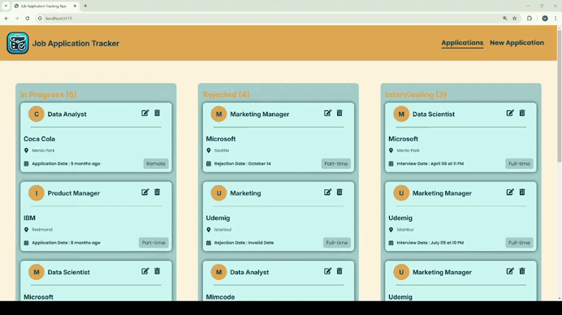

# 🚀 Job Application Tracker with Redux Toolkit 🛠️

# 📌 Project Overview: 
The Job Application Tracker is designed to help users manage and organize their job applications efficiently throughout their career journey. This application leverages Redux Toolkit to streamline key functionalities like creating, updating, and filtering job applications, ensuring a seamless and productive user experience.

# What I learned:
✔️ This CRUD application provided me a great chance to deepen my learning in Redux Toolkit and API integration. 

# Project Preview

